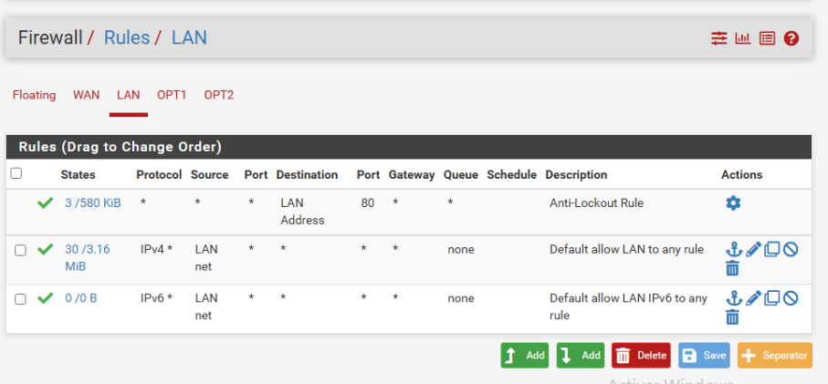
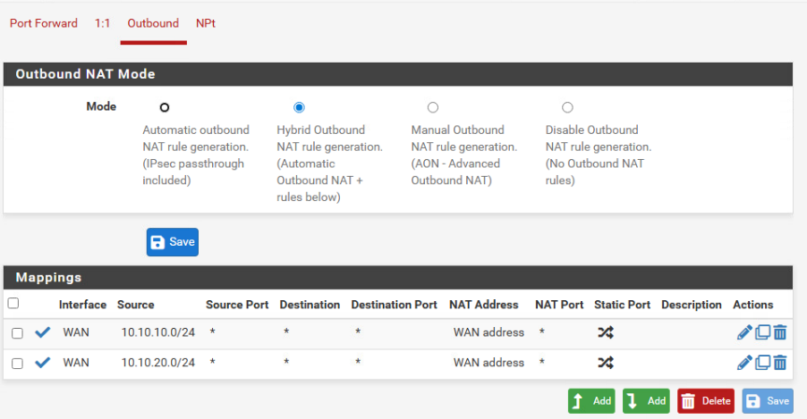

Mise en place du routage 

Mise en place des règle de Firewall

pour un projet on a un

reseaux wan

reseaux lan 10.10.10.0 Server

reseaux opt 10.10.20.0 admin

reseaux opt2 10.10.30.0 client

  

on bloque tout les port

automatisation https et http

regle automatisé DNS vers DNS dampierre

client + admin DNS vers gestion

Admin vers gestion admin AD

Mise en place du NAT
