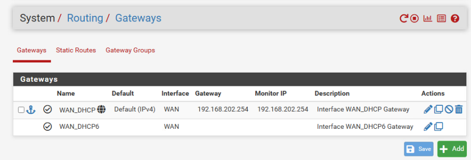

```
ssh admin@192.168.202.11
```
faire le stunnel ssh depuis pc au site pour recuperer le fichier vpn 
```
ssh -L 8443:10.10.30.254:80 admin@192.168.202.11
```
Identifiants
admin
pfsense


Mise en place du routage 

Mise en place des règle de Firewall

pour un projet on a un

Réseaux wan

Réseaux lan_server 10.10.10.0 Server

Réseaux opt1_admin 10.10.20.0 admin

Réseaux opt2_clients 10.10.30.0 client

  

on bloque tout les port

automatisation https et http

règle automatisé DNS vers DNS Dampierre

client + admin DNS vers gestion

Admin vers gestion admin AD

Mise en place de differante regle 


Mise en place du Nat en hybrid outbound nat rule generation ( automatic Outbound NAT+ rules below)

